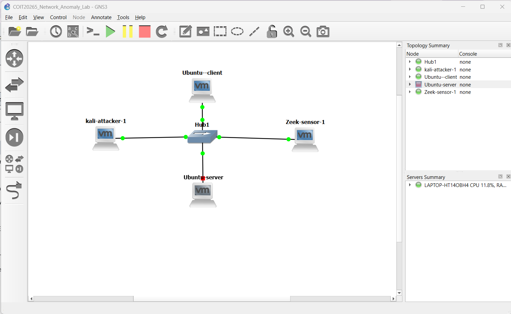

# GNS3 Virtual Network and Traffic Generation Laboratory

This directory contains the controlled virtual-network laboratory developed for the **COIT20265 Network Anomaly Detection Project**.

The laboratory is designed to generate reproducible normal and controlled anomalous network traffic, capture PCAP files, generate Zeek logs, and prepare connection-level information for later anomaly-detection testing.

---

## Final Laboratory Topology

<p align="center">
  
</p>

**Figure 1. Final four-role GNS3 laboratory topology.**

The laboratory contains four main roles:

| Role | System | Address / Mode | Purpose |
|---|---|---|---|
| Normal Client | Ubuntu Client | `192.168.10.10/24` | Generates legitimate network traffic |
| Application/File Server | Ubuntu Server | `192.168.10.20/24` | Provides normal network services |
| Controlled Attacker | Kali Linux | `192.168.10.30/24` | Used for authorised controlled testing |
| Monitoring Sensor | Zeek Sensor | Passive interface | Captures and analyses network traffic |

All systems are connected through a GNS3 Ethernet Hub.

---

## Laboratory Network

**Network:** `192.168.10.0/24`

**Subnet mask:** `255.255.255.0`

During final controlled experiments:

- no default gateway is configured;
- no GNS3 NAT node is connected;
- no GNS3 Cloud node is connected;
- no external router is connected.

This design keeps controlled experimental traffic inside the authorised laboratory environment.

Temporary external connectivity was used only when required for software installation and was removed before the final controlled traffic capture.

---

## Technologies Used

- GNS3
- VMware Workstation
- Ubuntu 26.04
- Kali Linux
- Zeek 8.0.9
- tcpdump
- Wireshark
- dnsmasq
- OpenSSH
- Python HTTP server

---

## Current Progress

### Environment and Topology

- [x] GNS3 installed and configured
- [x] VMware virtual machines integrated with GNS3
- [x] Four-role topology designed
- [x] Ubuntu client added
- [x] Ubuntu server added
- [x] Kali attacker added
- [x] Zeek sensor added
- [x] Ethernet Hub used for passive traffic observation

### Network Configuration

- [x] `192.168.10.0/24` laboratory network configured
- [x] Ubuntu client configured as `192.168.10.10`
- [x] Ubuntu server configured as `192.168.10.20`
- [x] Kali attacker planned as `192.168.10.30`
- [x] Client/server connectivity verified
- [x] Zeek passive monitoring interface configured
- [x] VMware DHCP contamination identified and corrected
- [x] Final capture restricted to the authorised laboratory subnet

### Zeek Monitoring

- [x] Zeek 8.0.9 installed
- [x] Zeek executable path configured
- [x] Passive interface `ens33` configured
- [x] Packet visibility verified using tcpdump
- [x] Normal traffic PCAP captured
- [x] PCAP processed using Zeek
- [x] Zeek protocol logs generated
- [x] Connection fields extracted

### Normal Traffic

- [x] HTTP service configured
- [x] HTTP GET requests generated
- [x] DNS service configured
- [x] `app.lab` DNS record created
- [x] DNS queries generated
- [x] SSH service configured
- [x] SSH sessions generated
- [x] ICMP connectivity traffic generated
- [x] Clean normal PCAP captured
- [x] Zeek logs inspected
- [x] `conn_features.tsv` generated
- [x] PCAP and log files exported to the host computer
- [x] Experimental files uploaded to GitHub

### Remaining Laboratory Work

- [ ] Legitimate backup/file-transfer traffic
- [ ] Controlled Nmap reconnaissance
- [ ] Controlled bulk/exfiltration-like transfer
- [ ] Separate PCAPs and Zeek logs for anomalous scenarios
- [ ] Complete Zeek-to-model feature mapping
- [ ] Integrate laboratory records with the anomaly-detection pipeline

---

## Current Normal-Traffic Pipeline

```text
Ubuntu Client
192.168.10.10
       |
       | HTTP / DNS / SSH / ICMP
       v
Ubuntu Server
192.168.10.20
       |
       v
GNS3 Ethernet Hub
       |
       v
Zeek Sensor
Passive Monitoring
       |
       v
tcpdump
       |
       v
normal_web_dns_ssh.pcap
       |
       v
Zeek
       |
       +---- conn.log
       +---- http.log
       +---- dns.log
       +---- ssh.log
       +---- files.log
       +---- packet_filter.log
       |
       v
conn_features.tsv
       |
       v
Future preprocessing and anomaly-detection pipeline
