# GS3 Virtual Network and Traffic Generation Laboratory

This directory contains the controlled virtual-network laboratory developed. The laboratory is designed to generate reproducible normal and controlled anomalous network traffic, capture PCAP files, generate Zeek logs, and prepare connection-level information for later anomaly-detection testing.

## Final Laboratory Topology

<p align="center">
  
</p>

**Figure 1. Final four-role GNS3 laboratory topology.**

The laboratory contains four main roles:

| Role | System | Address / Mode | Purpose |
|---|---|---|---|
| Normal Client | Ubuntu Client | 192.168.10.10/24 | Generates legitimate network traffic |
| Application/File Server | Ubuntu Server | 192.168.10.20/24 | Provides normal network services |
| Controlled Attacker | Kali Linux | 192.168.10.30/24 | Used for authorised controlled testing |
| Monitoring Sensor | Zeek Sensor | Passive interface | Captures and analyses network traffic |

All systems are connected through a GNS3 Ethernet Hub.

## Laboratory Network

**Network:** 192.168.10.0/24

**Subnet mask:** 255.255.255.0

During final controlled experiments:
1. no default gateway is configured;
2. no GNS3 NAT node is connected;
3. no GNS3 Cloud node is connected;
4. no external router is connected.

This design keeps controlled experimental traffic inside the authorised laboratory environment.

Temporary external connectivity was used only when required for software installation and was removed before the final controlled traffic capture.

## Technologies Used

- GNS3
- VMware Workstation
- Ubuntu 26.04
- Kali Linux
- Zeek 8.0.9
- tcpdump
- Wireshark
- dnsmasq
- OpenSSH
- Python HTTP server

## Current Normal-Traffic Pipeline

```text
Ubuntu Client
192.168.10.10
       |
       | HTTP / DNS / SSH / ICMP
       v
Ubuntu Server
192.168.10.20
       |
       v
GNS3 Ethernet Hub
       |
       v
Zeek Sensor
Passive Monitoring
       |
       v
tcpdump
       |
       v
normal_web_dns_ssh.pcap
       |
       v
Zeek
       |
       +---- conn.log
       +---- http.log
       +---- dns.log
       +---- ssh.log
       +---- files.log
       +---- packet_filter.log
       |
       v
conn_features.tsv
       |
       v
Future preprocessing and anomaly-detection pipeline

```

## Controlled Attack Traffic

After normal traffic generation was completed, four controlled attack
scenarios were created against the Ubuntu server.

All attack testing was performed only against systems belonging to the
authorised laboratory environment.

The four scenarios were:

1. Nmap port scan
2. Bulk file transfer
3. HTTP request burst
4. DNS query burst

### Nmap Port Scan

The Kali attacker at 192.168.10.30 performed a controlled Nmap scan
against the Ubuntu server at 192.168.10.20.

<p align="center">
  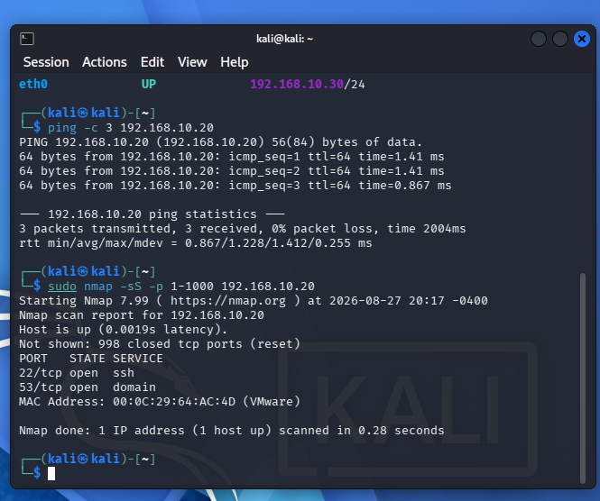
</p>

**Figure 2. Controlled Nmap scan generated from the Kali attacker.**

Zeek captured connections from the Kali attacker to many different
destination ports on the Ubuntu server.

<p align="center">
  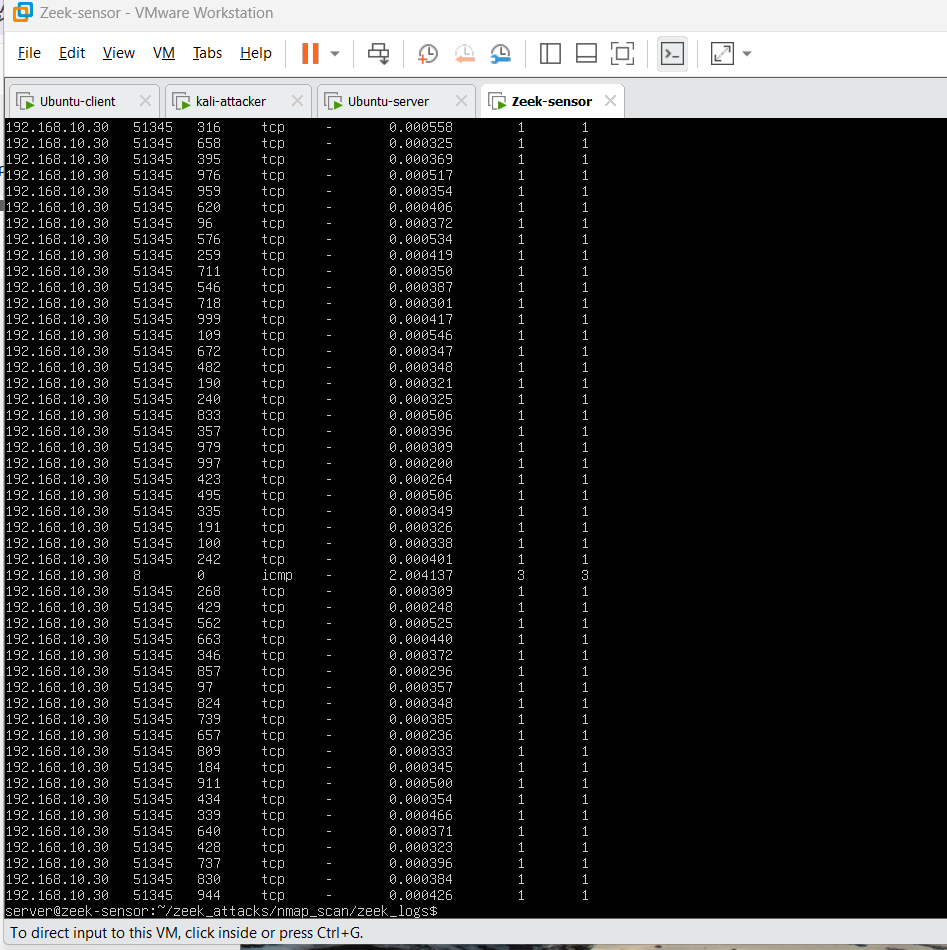
</p>

**Figure 3. Nmap scanning behaviour observed in the Zeek connection data.**

### Bulk File Transfer

A large test file was created on Kali and transferred to the Ubuntu
server using SCP. The purpose of this test was to generate high-volume transfer traffic
that could later be analysed by the anomaly-detection models.

<p align="center">
  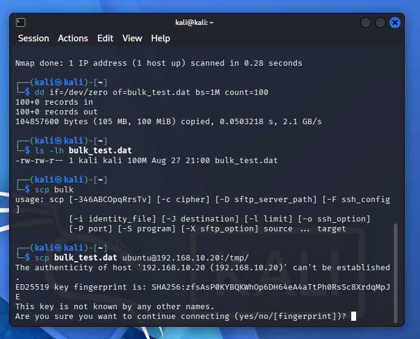
</p>

**Figure 4. Large test file created and transferred from Kali.**

The traffic was captured and processed using Zeek. The connection
information showed a large amount of transferred data over SSH.

<p align="center">
  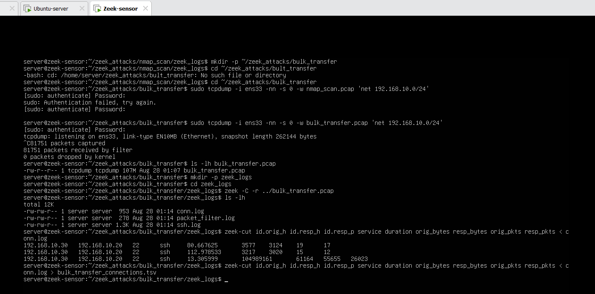
</p>

**Figure 5. Bulk-transfer traffic recorded and analysed using Zeek.**

### HTTP Request Burst

A repeated HTTP request test was generated from Kali against the
web service running on the Ubuntu server.

Zeek generated http.log and recorded repeated successful HTTP GET
requests.

<p align="center">
  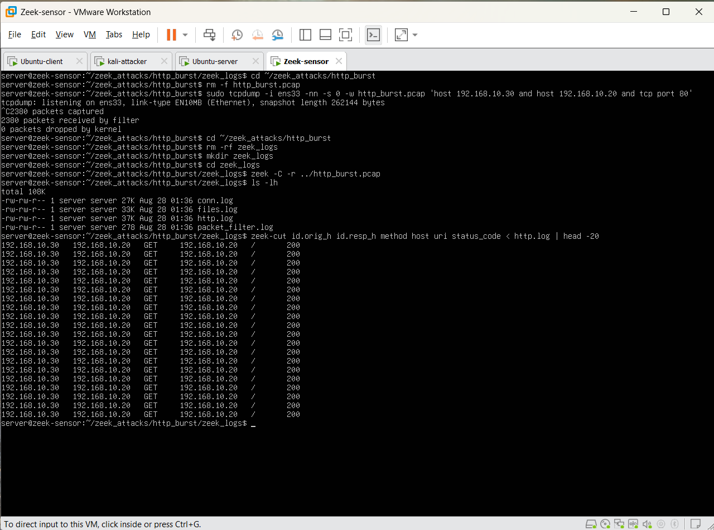
</p>

**Figure 6. Repeated HTTP GET requests observed in the Zeek HTTP log.**

### DNS Query Burst

A DNS service was configured on the Ubuntu server using the test
domain app.lab.

The Kali attacker first confirmed that the DNS service was working
and then generated repeated DNS queries.

<p align="center">
  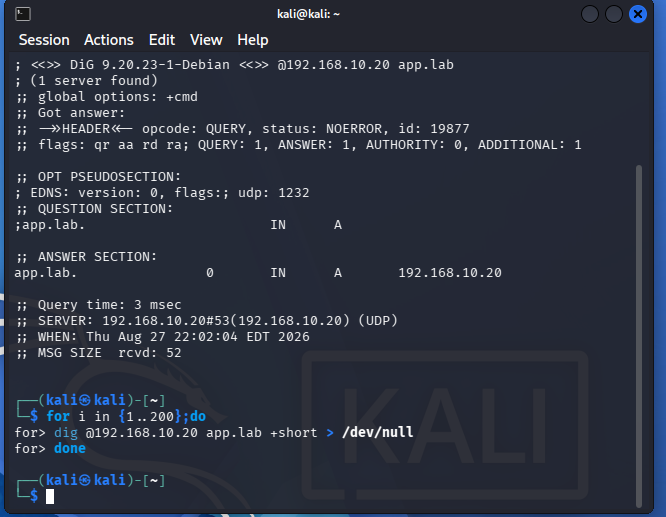
</p>

**Figure 7. DNS queries generated from the Kali attacker.**

Zeek recorded the repeated DNS queries in dns.log.

<p align="center">
  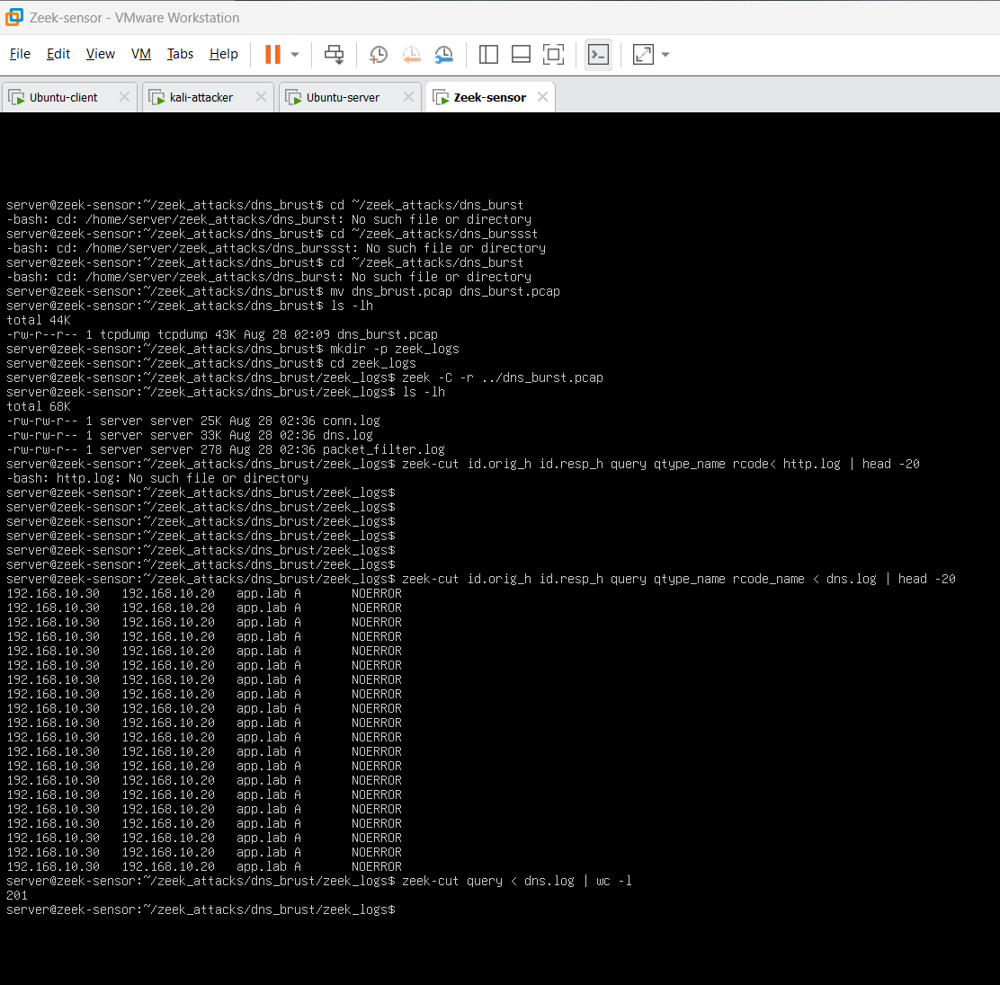
</p>

**Figure 8. Repeated DNS queries observed in the Zeek DNS log.**

## Zeek Feature Extraction

For each traffic scenario, selected connection information was extracted
from the Zeek conn.log.

The main raw Zeek fields were:

- timestamp;
- source IP address;
- source port;
- destination IP address;
- destination port;
- protocol;
- service;
- duration;
- source IP bytes;
- destination IP bytes;
- source packet count;
- destination packet count; and
- connection state.

These 13 fields were used as the source information for later feature
engineering.

<p align="center">
  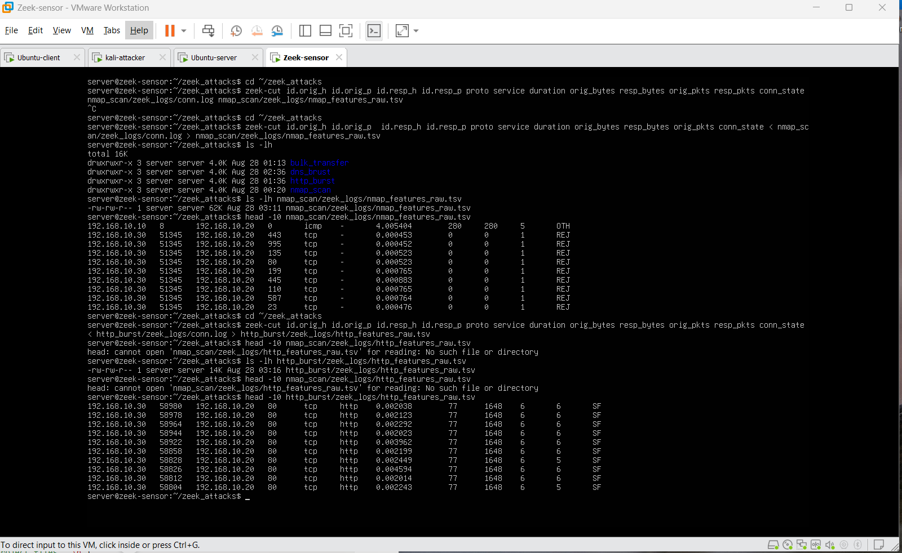
</p>

**Figure 9. Extraction of connection information from Zeek logs.**

The generated feature files for the different attack scenarios were
checked before being combined.

<p align="center">
  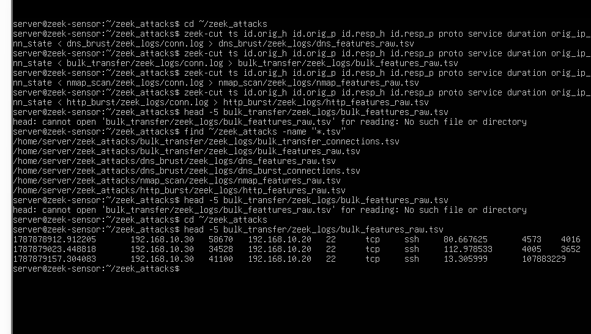
</p>

**Figure 10. Verification of the raw Zeek feature files.**

## Combined Attack Dataset

The four attack datasets were combined into one file and an
attack_type field was added so that each record could be linked to
its original traffic scenario.

<p align="center">
  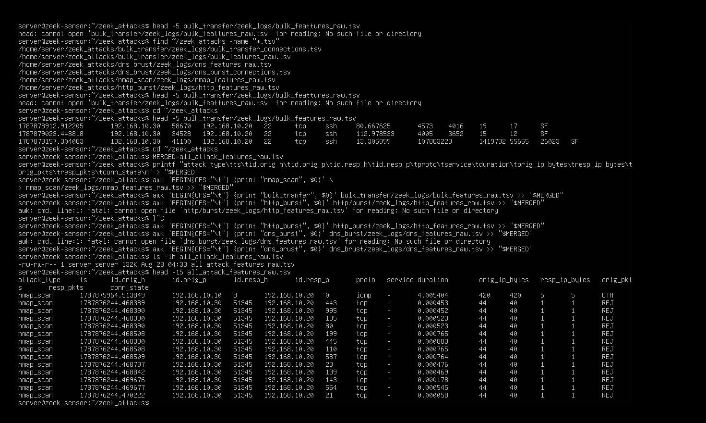
</p>

**Figure 11. Attack records combined into a single dataset.**

## Normal and Attack Traffic Integration

The earlier normal traffic was regenerated using the same Zeek fields
as the attack data.

<p align="center">
  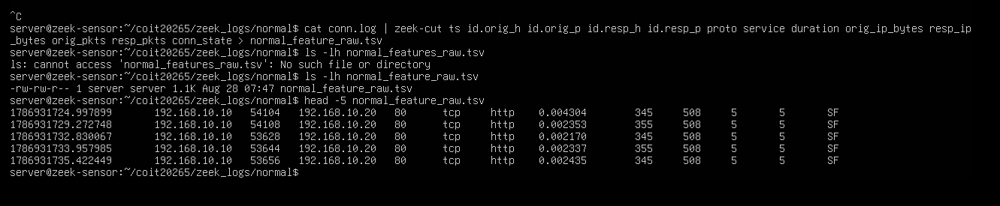
</p>

**Figure 12. Normal traffic converted into the same raw feature format.**

Normal and attack records were then combined into the final laboratory
traffic dataset.

The final dataset contained:

| Traffic Type | Records |
|---|---:|
| Normal | 12 |
| Nmap scan | 1,002 |
| HTTP burst | 200 |
| DNS burst | 199 |
| Bulk transfer | 3 |
| **Total** | **1,416** |

<p align="center">
  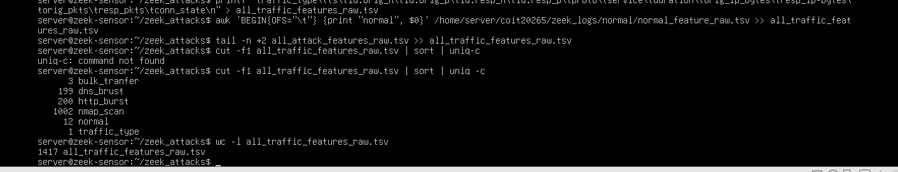
</p>

**Figure 13. Final normal and attack traffic dataset.**

## Feature Preparation for Machine Learning

The raw Zeek information was not used directly by the machine-learning
models.

The laboratory traffic followed this preparation process:

```text
13 raw Zeek fields
        |
        v
Feature engineering
        |
        v
21 portable network features
        |
        v
Existing preprocessing pipeline
        |
        v
41 numerical model features
