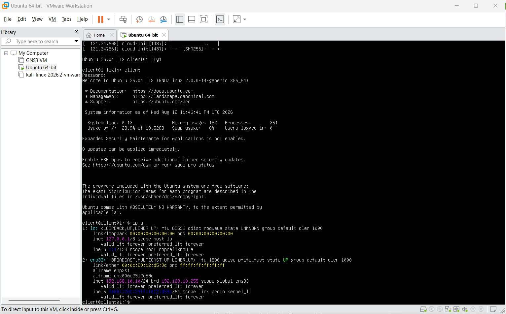
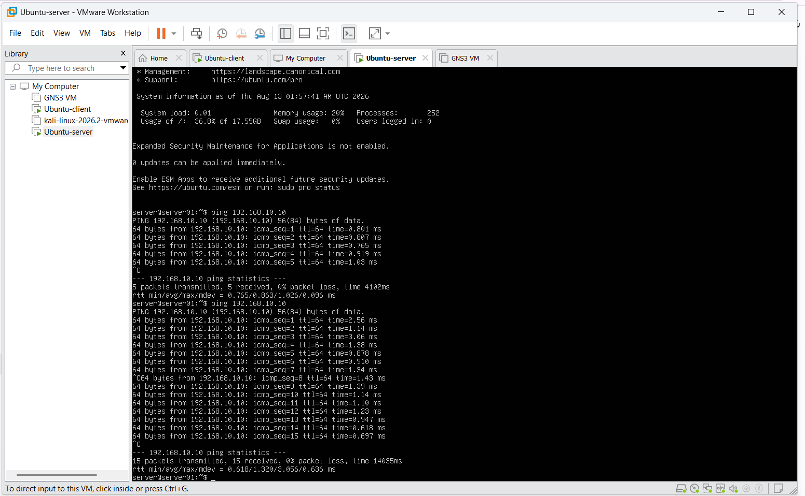

# GNS3 IP Addressing and Isolation Plan

## IP Addressing

| Role | Hostname | IP Address | Subnet Mask | Default Gateway |
|---|---|---|---|---|
| Normal Client | Ubuntu-client | `192.168.10.10` | `255.255.255.0` | None |
| Application/File Server | Ubuntu-server | `192.168.10.20` | `255.255.255.0` | None |
| Controlled Attacker | Kali-attacker | `192.168.10.30` | `255.255.255.0` | None |
| Monitoring Sensor | Zeek-sensor | Passive monitoring interface | N/A | None |

**Network:** `192.168.10.0/24`

---

## Ubuntu Client Configuration

The Ubuntu client is configured as:

`192.168.10.10/24`

<p align="center">
  
</p>

**Figure 1. Ubuntu client IP address configuration.**

---

## Client-to-Server Connectivity

Connectivity between the Ubuntu client and Ubuntu server was tested using ICMP.

<p align="center">
  
</p>

**Figure 2. Successful connectivity between the laboratory client and server.**

The intended communication is:

```text
192.168.10.10
      |
      v
192.168.10.20
