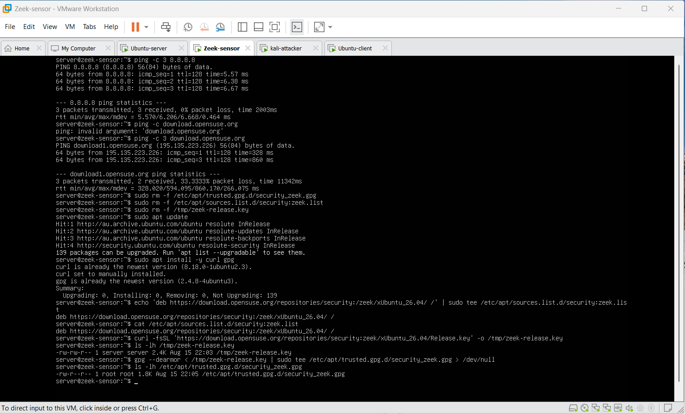

# Zeek Sensor Configuration

## Purpose

The Zeek sensor provides passive network monitoring for the COIT20265 GNS3 laboratory.

The sensor observes traffic passing through the GNS3 Ethernet Hub and generates structured connection and protocol logs.

---

## Software

- Ubuntu Server 26.04
- Zeek 8.0.9
- tcpdump
- VMware Workstation
- GNS3

---

## Zeek Installation

Zeek installation required configuring the appropriate package repository and installation key.

Troubleshooting evidence from the repository configuration is retained in:


This screenshot documents part of the package repository and key configuration process.

---

## Zeek PATH Configuration

After installation, the Zeek binary was available under:

```text
/opt/zeek/bin/zeek
