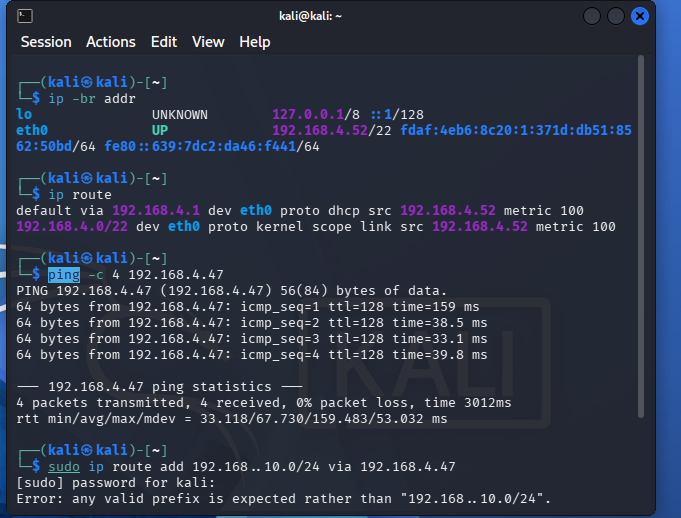
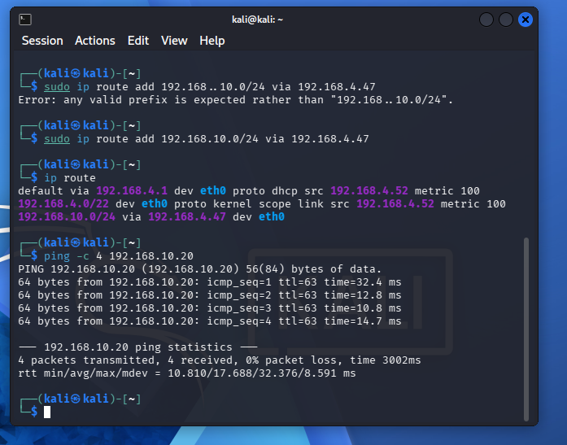
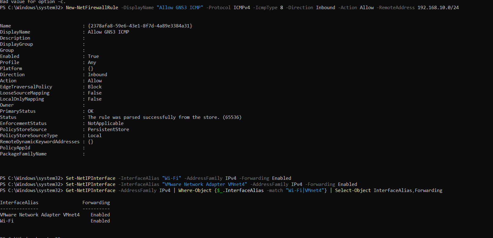
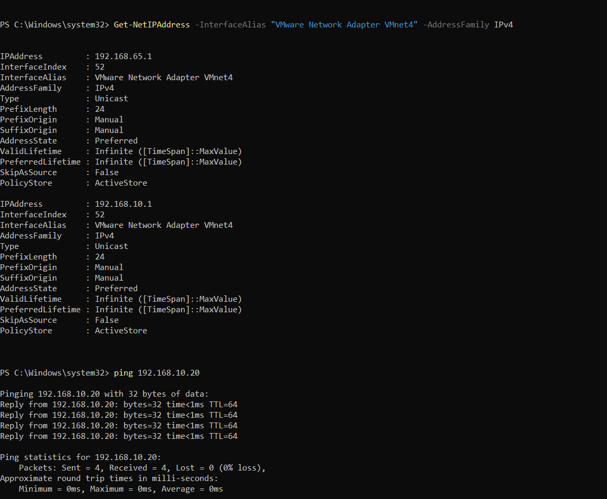
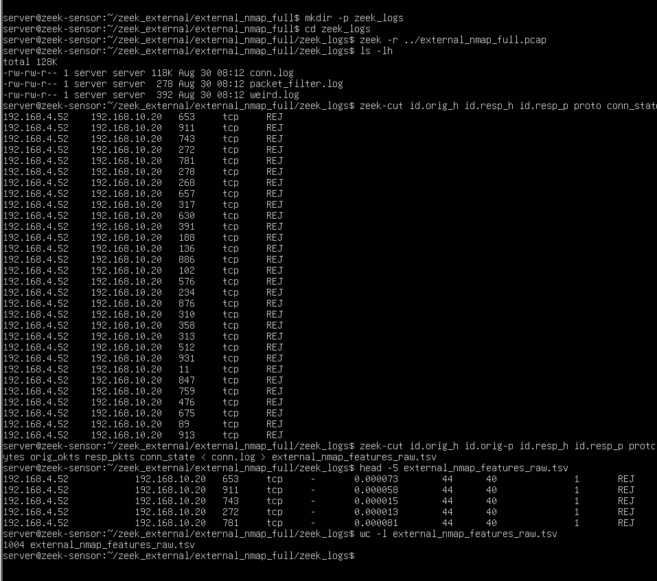

# External Physical-Laptop Validation

This folder contains the additional physical-laptop validation completed.

The purpose of this test was to check whether the GNS3 and Zeek environment could capture and analyse traffic coming from a different physical computer, rather than only using the virtual Kali attacker inside the original GNS3 laboratory.

## Test Environment

Two separate physical laptops were used.

Both laptops were connected to the same private Wi-Fi network.

Labannya's laptop was running Kali Linux in VMware and was used as the external attacker.

Arjita's laptop was running the GNS3 environment, including the Ubuntu Server and Zeek Sensor.

The main addresses used during the test were:

| System | IP Address |
|---|---|
| External Kali | 192.168.4.52 |
| Arjita's Windows host | 192.168.4.47 |
| GNS3-side host interface | 192.168.10.1 |
| Ubuntu Server | 192.168.10.20 |

## External Kali Connectivity

Labannya's Kali machine was running on a separate physical laptop.

The Kali machine received the IP address: 192.168.4.52

First, connectivity between the two physical laptops was checked.

Labannya's Kali machine successfully reached Arjita's Windows host at: 192.168.4.47

<p align="center">
  
</p>

**Figure 1. Labannya's Kali machine connected to the arjita laptop through the same private Wi-Fi network.**

A route was then added so that the external Kali machine could reach the GNS3 network: 192.168.10.0/24 via 192.168.4.47
After the correct route was configured, Kali successfully reached the Ubuntu Server at: 192.168.10.20

The ping test completed with 0% packet loss.

<p align="center">
  
</p>

**Figure 2. Successful connection from Labannya's external Kali machine to the Ubuntu Server inside the GNS3 network.**

This confirmed that the external laptop could communicate with the GNS3 server before the controlled Nmap test was performed.
## Network Connection

The external Kali machine and the GNS3 environment were on different network ranges.

The external Kali machine was on:192.168.4.0/22
The GNS3 laboratory was on:192.168.10.0/24

Routing was therefore configured on the Windows host so that traffic could pass between the private Wi-Fi network and the GNS3 laboratory network.

IPv4 forwarding was enabled on the Wi-Fi interface and the VMware VMnet4 interface.

<p align="center">
  
</p>

**Figure 3. IPv4 forwarding configured for communication with the GNS3 network.**

The Windows host was also able to communicate successfully with the Ubuntu Server at `192.168.10.20`.

<p align="center">
  
</p>

**Figure 4. Successful connectivity test to the Ubuntu Server.**


## External Kali Connectivity

After the routing configuration was completed, the Kali machine running on Labannya's separate laptop was able to communicate with the Ubuntu Server.

The external Kali address was: 192.168.4.52
The target Ubuntu Server was: 192.168.10.20
A ping test was used first to confirm that the connection was working before performing the controlled Nmap test.

## Controlled External Nmap Scan

After connectivity was confirmed, a controlled Nmap scan was performed from Labannya's Kali machine against the Ubuntu Server.

The scan was performed only against the authorised project server.

The traffic path was:

```text
Labannya's Physical Laptop
        |
        v
Kali Linux
192.168.4.52
        |
        v
Private Wi-Fi Network
        |
        v
Arjita's Windows Host
192.168.4.47
        |
        v
VMnet4 / Routing
192.168.10.1
        |
        v
Ubuntu Server
192.168.10.20
```

The purpose of this test was to generate reconnaissance traffic from a completely separate physical computer.

## Packet Capture and Zeek Analysis

The Nmap traffic was captured as a PCAP file.

The full packet capture is stored as:

### `external_nmap_full.pcap`

The PCAP was later analysed using Zeek.

Zeek generated connection records showing the external Kali system as the traffic originator and the Ubuntu Server as the destination.

The final Zeek result showed: 192.168.4.52 -> 192.168.10.20

The scan generated connections to many different destination ports.

<p align="center">
  
</p>

**Figure 3. External Nmap traffic from Labannya's physical laptop analysed using Zeek.**

Approximately 1,004 Zeek connection records were extracted from the full external Nmap capture.

## Why This Test Was Performed

The original controlled attacks were generated using virtual machines inside the GNS3 laboratory.

This additional experiment extended the practical testing by using Kali Linux on another physical laptop.

This showed that the network setup could receive, capture and analyse traffic generated from a separate physical device.

It also provided additional practical validation of the Zeek traffic collection process before the data was prepared for the anomaly-detection models.

## External Validation Flow

```text
Separate Physical Laptop
        |
        v
Kali Linux
192.168.4.52
        |
        v
Private Wi-Fi
        |
        v
Host Routing
        |
        v
Ubuntu Server
192.168.10.20
        |
        v
Packet Capture
        |
        v
Zeek Analysis
        |
        v
External Nmap Connection Records
```

## Files

| File | Description |
|---|---|
| external_nmap_full.pcap | Full packet capture from the external Nmap test |

Additional screenshots showing the routing, connectivity and Zeek results are stored in the main gns3/screenshots/ directory.

## Safety and Scope

The Nmap scan was performed only against the Ubuntu Server created for the authorised university project laboratory.
No external or unauthorised systems were scanned.
