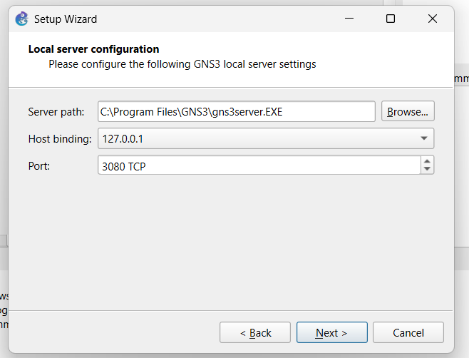
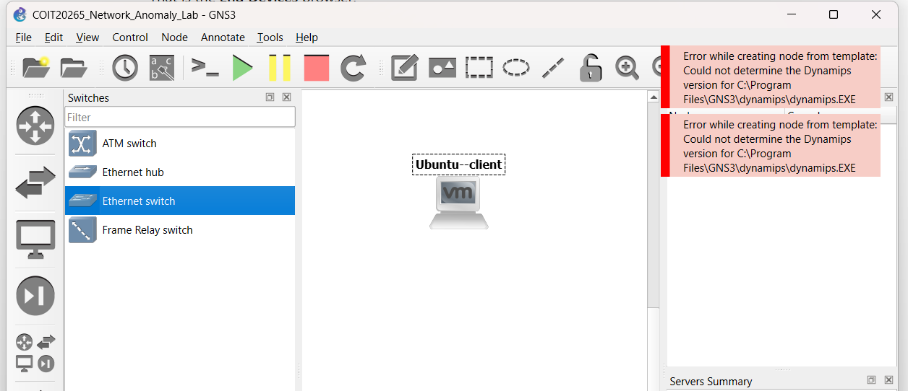
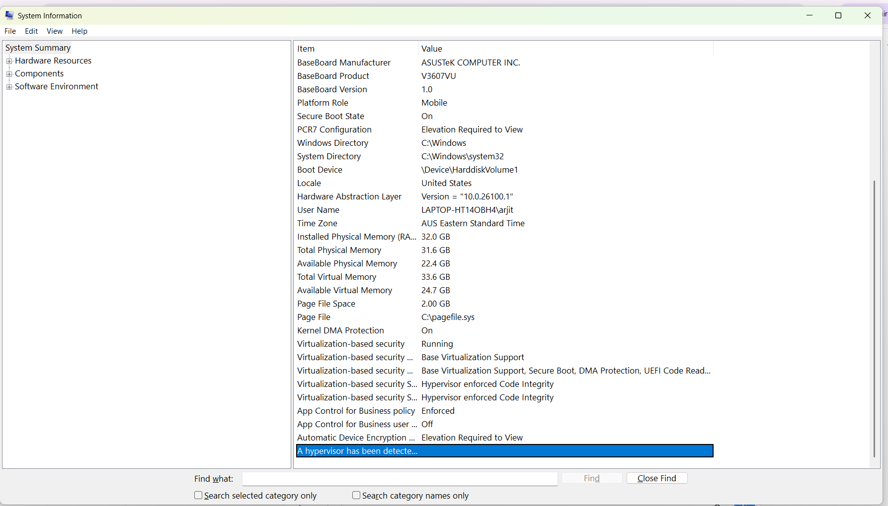

# Four-Role GNS3 Laboratory Topology

## 1. Final Topology


**Figure 1. Final four-role GNS3 topology.**

| Role | IP / Mode | Purpose |
|---|---|---|
| Ubuntu Client | `192.168.10.10/24` | Generates normal traffic |
| Ubuntu Server | `192.168.10.20/24` | Provides HTTP, DNS and SSH |
| Kali Attacker | `192.168.10.30/24` | Controlled attack traffic |
| Zeek Sensor | Passive `ens33` | Network monitoring |

All systems are connected through **Hub1** on the isolated `192.168.10.0/24` network.

During controlled experiments, no default gateway, NAT node, Cloud node or external router is used.

---

## 2. GNS3 and VMware Setup

Initial GNS3 configuration:



**Figure 2. Initial GNS3 configuration.**

During setup, GNS3/VMware integration problems were encountered.



**Figure 3. GNS3 configuration error encountered during setup.**



**Figure 4. GNS3 VM/VMware integration issue.**

These issues were resolved before completing the final four-role topology.

---

## 3. IP Addressing and Connectivity

The Ubuntu client was configured as `192.168.10.10/24`.


**Figure 5. Ubuntu client IP configuration.**

Connectivity between the Ubuntu client and Ubuntu server was successfully verified.


**Figure 6. Successful client-to-server connectivity.**

Additional ICMP testing evidence:


**Figure 7. Additional ICMP connectivity test.**

---

## 4. Normal Traffic Generation

### HTTP

The Ubuntu server provided a Python HTTP service on TCP port 80.


**Figure 8. HTTP service running on the Ubuntu server.**

### DNS

`dnsmasq` was configured with the local DNS record:

```text
app.lab → 192.168.10.20
