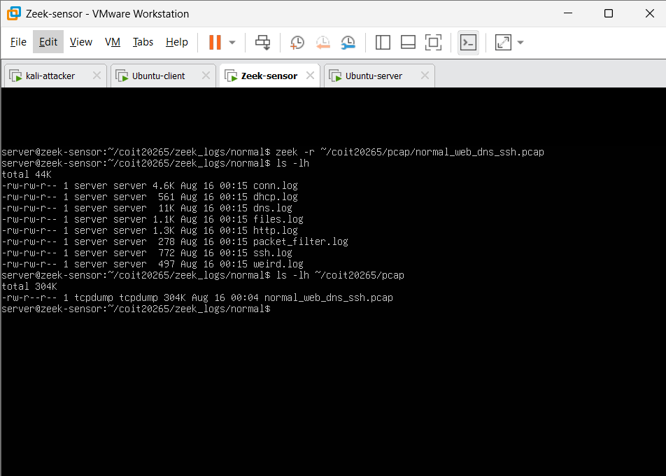
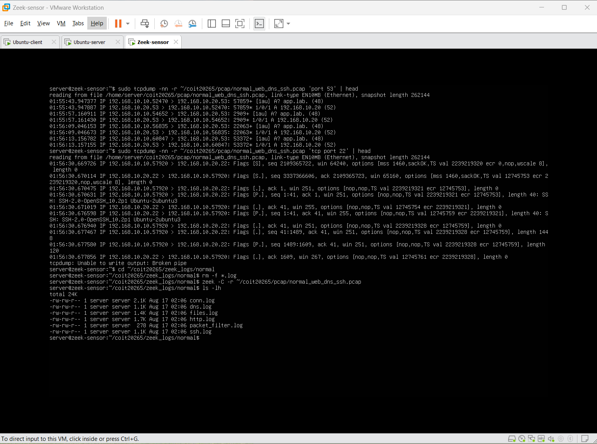
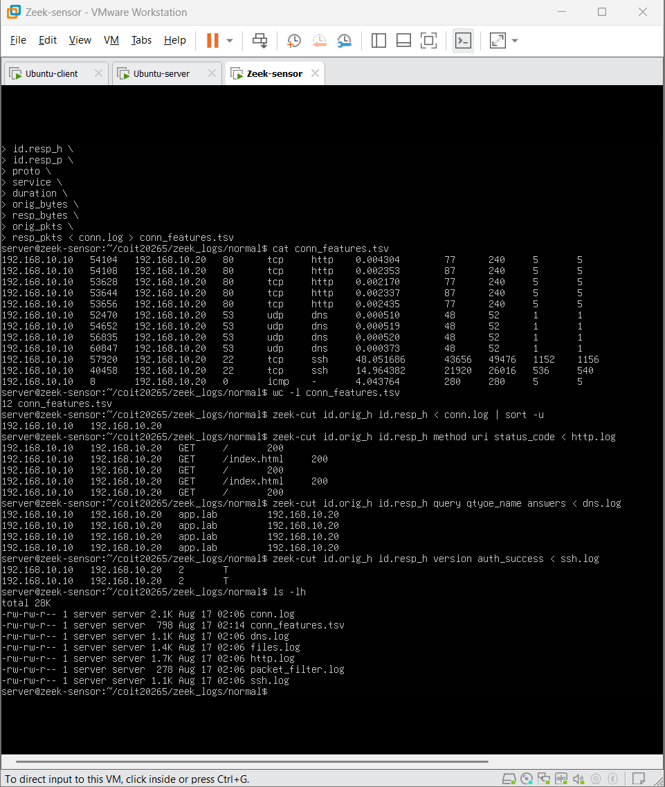

# Traffic Scenarios

This directory contains the controlled laboratory traffic generated for the COIT20265 Network Anomaly Detection project.

## Packet Capture

Traffic was captured passively by the Zeek sensor using `tcpdump`.

Final clean capture:

`normal/normal_web_dns_ssh.pcap`

The final PCAP was approximately **417 KB**.



**Figure 1. Normal traffic PCAP successfully created.**

---

## Zeek Processing

The PCAP was processed using Zeek and generated:

- `conn.log`
- `http.log`
- `dns.log`
- `ssh.log`
- `files.log`
- `packet_filter.log`



**Figure 2. Zeek logs generated from the normal PCAP.**

---

## Connection Feature Extraction

The following connection-level fields were extracted from `conn.log`:

- Source IP
- Source port
- Destination IP
- Destination port
- Protocol
- Service
- Duration
- Originator bytes
- Responder bytes
- Originator packets
- Responder packets

The extracted records were saved as:

`normal/conn_features.tsv`



**Figure 3. Validation of HTTP, DNS, SSH and extracted connection features.**

The current file contains **12 connection records** covering HTTP, DNS, SSH and ICMP traffic.

---

## Current Normal Traffic Files

```text
normal/
├── normal_web_dns_ssh.pcap
├── conn_features.tsv
├── conn.log
├── dns.log
├── files.log
├── http.log
├── packet_filter.log
└── ssh.log
```


## Traffic Scenarios

| Scenario | Type | Status |
|---|---|---|
| HTTP / DNS / SSH / ICMP | Normal | ✅ Completed |
| Legitimate backup / file transfer | Normal | ⏳ Planned |
| Nmap reconnaissance | Controlled anomalous | ⏳ Planned |
| Bulk / exfiltration-like transfer | Controlled anomalous | ⏳ Planned |
