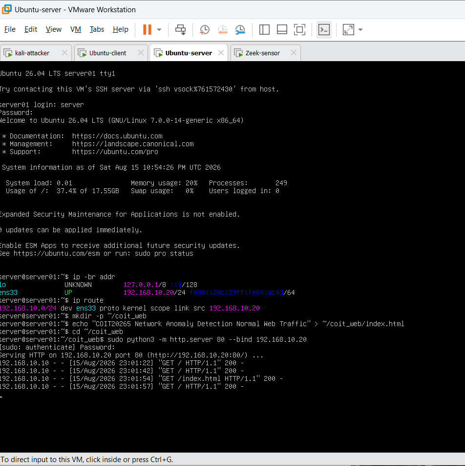
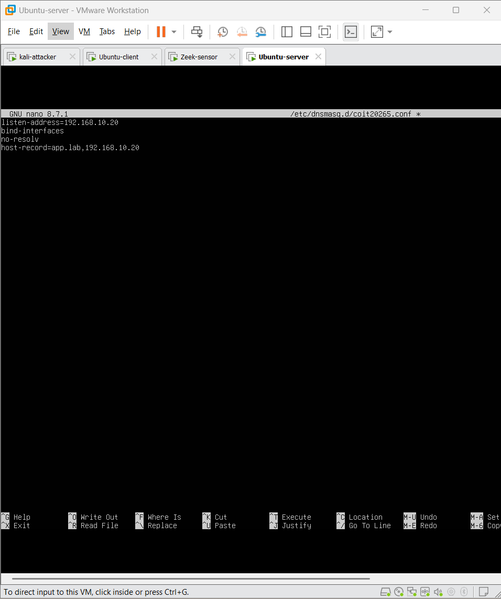
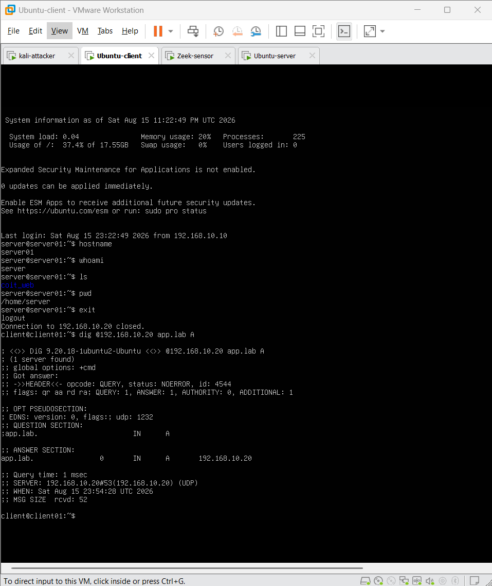
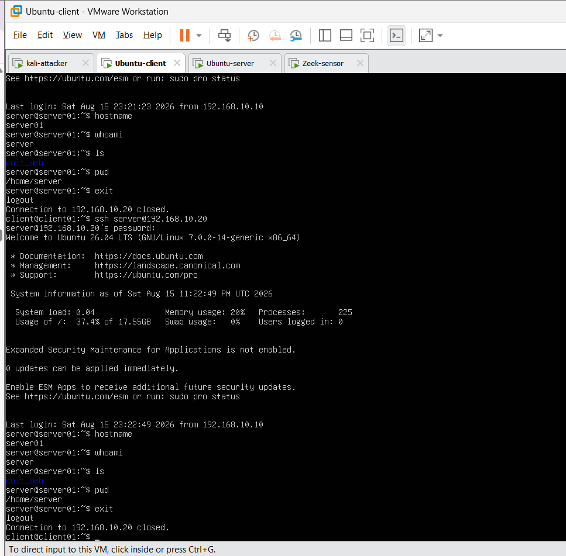

# Normal Traffic Services

This document records the normal HTTP, DNS, SSH and ICMP traffic generated between the Ubuntu client and Ubuntu server.

## Ubuntu Client

**IP address:** `192.168.10.10/24`

## Ubuntu Server

**IP address:** `192.168.10.20/24`

The Ubuntu server provides the normal services used during the experiment.

---

## 1. HTTP Traffic

A Python HTTP server was configured on **TCP port 80**.



**Figure 1. HTTP service running on the Ubuntu server and receiving client requests.**

The Ubuntu client generated HTTP GET requests to:

```text
http://192.168.10.20/
http://192.168.10.20/index.html
```

Successful requests returned HTTP status `200`.

---

## 2. DNS Traffic

DNS was configured using `dnsmasq` on port `53`.

The local DNS record was:

```text
app.lab → 192.168.10.20
```



**Figure 2. dnsmasq configuration on the Ubuntu server.**

The Ubuntu client successfully queried the DNS service.



**Figure 3. Successful resolution of `app.lab` to `192.168.10.20`.**

---

## 3. SSH Traffic

OpenSSH was configured on **TCP port 22**.

The Ubuntu client connected to the server using:

```bash
ssh server@192.168.10.20
```

Normal commands were executed during the SSH sessions, including:

```text
hostname
whoami
pwd
ls
exit
```



**Figure 4. Successful SSH sessions between the Ubuntu client and Ubuntu server.**

---

## 4. ICMP Traffic

ICMP traffic was generated using `ping` to verify normal client-server connectivity.

```text
192.168.10.10 → 192.168.10.20
```


**Figure 5. Successful ICMP communication between the Ubuntu client and server.**

---

## Normal Traffic Generated

The completed normal traffic includes:

- HTTP GET requests
- DNS queries
- SSH sessions
- ICMP connectivity traffic

All traffic was passively observed by the Zeek sensor and later captured for PCAP and Zeek log analysis.
